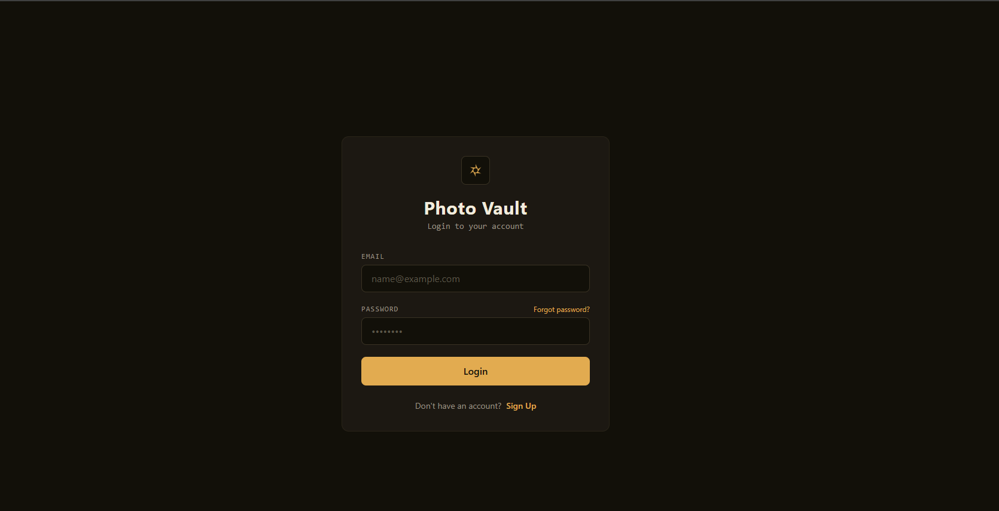
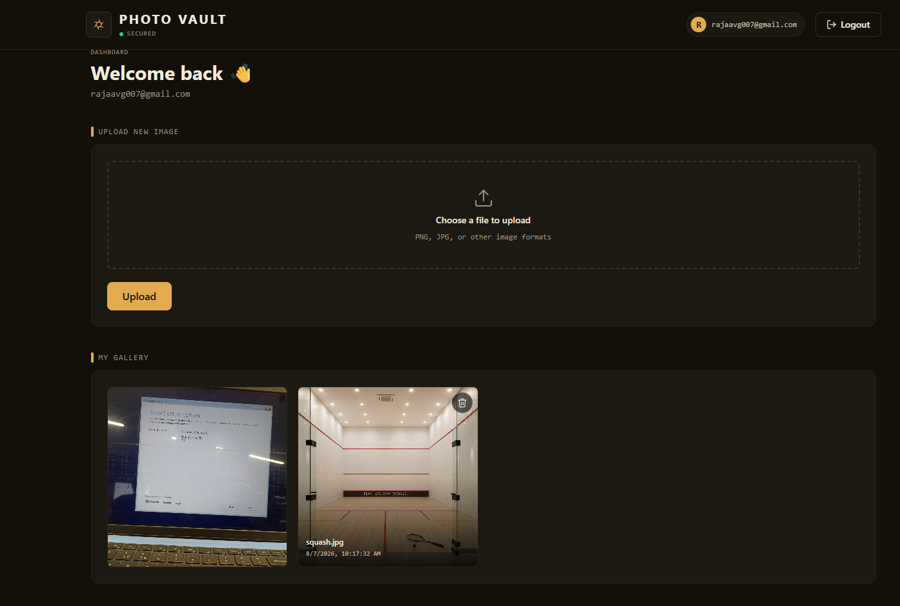
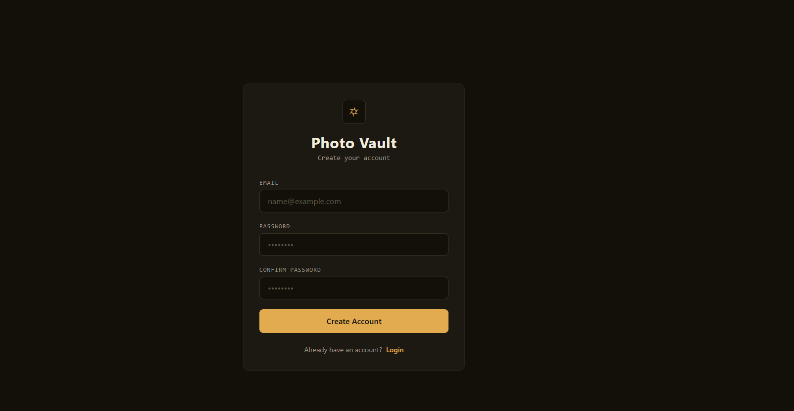

# 📸 AWS Photo Vault

A secure full-stack photo management application built with **React**, **Node.js**, **Express**, and multiple **AWS services**. Users can securely authenticate with Amazon Cognito, upload images to Amazon S3, store metadata in Amazon RDS, and manage their personal gallery.

---

## 🚀 Features

### Authentication
- ✅ User Registration
- ✅ Email Verification (OTP)
- ✅ Secure Login
- ✅ Forgot Password
- ✅ Reset Password
- ✅ JWT Authentication
- ✅ Protected Routes
- ✅ Session Restoration

### Image Management
- ✅ Upload Images
- ✅ View Personal Gallery
- ✅ Delete Images
- ✅ Secure Image Access using Pre-signed URLs
- ✅ Original Filename Preservation
- ✅ User-specific S3 Folder Organization

### Security
- ✅ Amazon Cognito Authentication
- ✅ JWT Verification Middleware
- ✅ Private Amazon S3 Bucket
- ✅ Pre-signed URLs for Secure Image Access
- ✅ User Authorization (Users can only access their own images)

---

# 🏗️ Architecture

```text
                +----------------------+
                |      React App       |
                |      Frontend        |
                +----------+-----------+
                           |
                           | REST APIs
                           |
                +----------v-----------+
                |   Node.js + Express  |
                |      Backend         |
                +----+------------+----+
                     |            |
                     |            |
          +----------v--+      +--v-------------+
          | Amazon S3   |      | Amazon Cognito |
          | Image Store |      | Authentication |
          +-------------+      +----------------+
                     |
                     |
          +----------v-----------+
          | Amazon RDS (MySQL)   |
          | Image Metadata       |
          +----------------------+
```

---

# ☁️ AWS Services Used

| Service | Purpose |
|----------|---------|
| Amazon Cognito | User Authentication & OTP Verification |
| Amazon S3 | Image Storage |
| Amazon RDS (MySQL) | Store Image Metadata |
| Amazon EC2 | Backend Deployment (Ready) |
| IAM | Secure AWS Permissions |

---

# 🛠️ Tech Stack

## Frontend
- React.js
- React Router
- Axios
- Context API
- Tailwind CSS

## Backend
- Node.js
- Express.js
- Multer
- JWT
- MySQL2

## AWS
- Amazon Cognito
- Amazon S3
- Amazon RDS
- IAM

---

# 📂 Project Structure

```text
aws-photo-vault/

│
├── backend/
│   ├── config/
│   ├── controllers/
│   ├── middleware/
│   ├── routes/
│   ├── package.json
│   └── .env.example
│
├── frontend/
│   ├── src/
│   ├── public/
│   ├── package.json
│   └── .env.example
│
└── README.md
```

---

# 📸 Image Storage Structure

Images are organized by the Cognito User ID.

```text
photo-vault-bucket/

41534dea-1041-702f-6b15-7fedac1b6731/

    7af823-yoga.jpg
    2bc938-spa.jpg
    d8fa91-family.jpg

e1b38d8a-0091-70ac-5fff-3f341d853de2/

    a8d923-beach.jpg
    c912ad-cat.jpg
```

This structure:
- Prevents filename collisions
- Organizes images per user
- Scales to millions of users

---

# 🔐 Authentication Flow

```text
Sign Up
   │
   ▼
Email Verification (OTP)
   │
   ▼
Login
   │
   ▼
JWT Authentication
   │
   ▼
Protected Dashboard
```

---

# 📷 Image Upload Flow

```text
Choose Image
      │
      ▼
React
      │
      ▼
Express Backend
      │
      ▼
Amazon S3
      │
      ▼
Store Metadata in RDS
      │
      ▼
Display in Gallery
```

---

# 🗄️ Database Schema

```sql
images

id
image_url
file_name
original_name
uploaded_by
uploaded_at
```

---

# ⚙️ Installation

## Clone Repository

```bash
git clone https://github.com/<your-username>/aws-photo-vault.git

cd aws-photo-vault
```

---

## Backend

```bash
cd backend

npm install
```

Create `.env`

```env
AWS_REGION=

AWS_ACCESS_KEY_ID=

AWS_SECRET_ACCESS_KEY=

AWS_BUCKET_NAME=

DB_HOST=
DB_USER=
DB_PASSWORD=
DB_NAME=

COGNITO_USER_POOL_ID=
COGNITO_CLIENT_ID=
```

Start Backend

```bash
npm start
```

---

## Frontend

```bash
cd frontend

npm install
```

Create `.env`

```env
VITE_API_URL=http://localhost:5000
```

Start Frontend

```bash
npm run dev
```

---

# 📡 API Endpoints

## Authentication

| Method | Endpoint |
|---------|----------|
| POST | /auth/signup |
| POST | /auth/confirm |
| POST | /auth/login |
| POST | /auth/forgot-password |
| POST | /auth/reset-password |
| GET | /auth/me |

---

## Images

| Method | Endpoint |
|---------|----------|
| POST | /upload |
| GET | /images |
| DELETE | /images/:id |

---

## 📸 Screenshots

### Login



### Dashboard



### Gallery


---

# 🚀 Future Enhancements

- Image Preview Before Upload
- Drag & Drop Upload
- Upload Progress Bar
- Image Download
- Image Rename
- Image Search
- Full-screen Image Viewer
- User Profile Dashboard
- Storage Usage Statistics
- Multi-image Upload
- Album Management
- CloudFront CDN Integration
- Docker Support
- CI/CD using GitHub Actions

---

# 👨‍💻 Author

**Raja Nayak**

M.Tech Computer Science Engineering  
University of Hyderabad

---